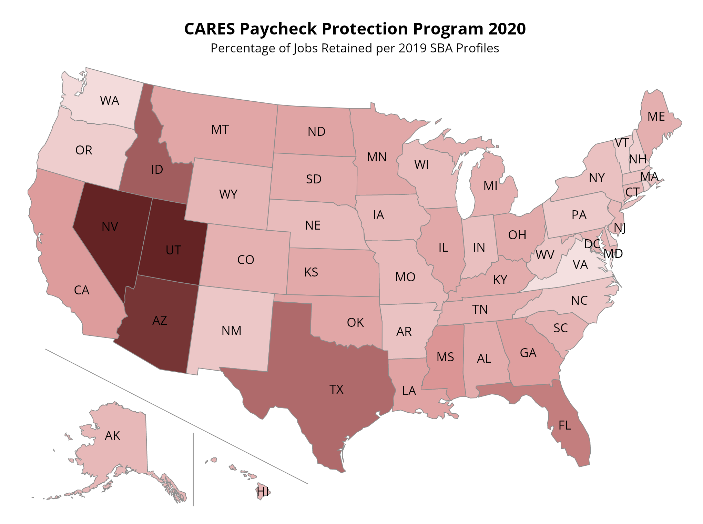

## Cares Act Paycheck Protection Program Loan Analysis

### Introduction
Total loan counts: 4,885,388

Total jobs retained: 51,125,891

Loan Range           |Loan Counts|Jobs Retained|Average Jobs Retained
------|------|------|------
a $5-10 million     |4840      |1639326     |338.7
b $2-5 million      |24838     |5167844     |208.1
c $1-2 million      |53030     |5906794     |111.4
d $350,000-1 million|199456    |10015580    |50.2
e $150,000-350,000  |379054    |8726969     |23.0
f $0-149,999        |4224170   |19669424    |4.7

### Loans up to $150k

LoanCounts|AverageLoanAmount|JobsRetained|AverageJobsRetained
----------|-----------------|------------|-------------------
4224170   |33568.83|19669424    |4.7 

### Loans above $150k

LoanCounts|JobsRetained|AverageJobsRetained
----------|------------|-------------------
661218    |31456467    |47.6  

### Loan Counts by NAICS Codes

NAICS Code|Loan Counts|Jobs Retained|Average Jobs Retained|Industry
---------|----------|------------|-------------------|----
|   999990|    222096|     1407174| 6.3| Unclassified Establishments
|   722511|    170471|     3470010| 20.4| Full-Service Restaurants
|   541110|    122616|      748971|  6.1| Offices of Lawyers
|   531210|    114144|      308578|  2.7| Offices of Real Estate Agents and Brokers
|   621111|    109148|     1184979|   10.9| Offices of Physicians (except Mental Health Specialists)
|   621210|    100078|      744024|  7.4| Offices of Dentists
|   813110|     88411|     1051114| 11.9| Religious Organizations
|   812112|     86561|      320814|  3.7| Beauty Salons
|   524210|     82922|      360081|  4.3| Insurance Agencies and Brokerages
|   722513|     78013|     1820214| 23.3| Limited-Service Restaurants
|   453998|     63728|      401973|  6.3| All Other Miscellaneous Store Retailers (except Tobacco Stores)
|   236115|     59011|      311914|  5.3| New Single-Family Housing Construction (except For-Sale Builders)
|   238220|     58756|      666188|   11.3| Plumbing, Heating, and Air-Conditioning Contractors
|   812990|     57747|      228974| 4.0| All Other Personal Services
|   541990|     57323|      359431|  6.3| All Other Professional, Scientific, and Technical Services
|   811111|     51681|      275085| 5.3| General Automotive Repair
|   484110|     50554|      300342|  5.9| General Freight Trucking, Local
|   236118|     49820|      226845|  4.6| Residential Remodelers
|   541618|     43884|      213308|  4.9| Other Management Consulting Services
|   561730|     43427|      401136|  9.2| Landscaping Services
|   238210|     43007|      538042| 12.5| Electrical Contractors and Other Wiring Installation Contractors
|   238990|     41891|      413546|    9.9| All Other Specialty Trade Contractors
|   721110|     40986|      886585| 21.6| Hotels (except Casino Hotels) and Motels
|   541611|     40097|      267615|  6.7| Administrative Management and General Management Consulting Services
|   624410|     39222|      467827| 11.9| Child Day Care Services

### Goal

### Methods

### Tools

### Results
[Jobs Retained by State](https://scopewave.clicdata.com/v/ctGJranstVXF)

[Small Business Served by State](https://scopewave.clicdata.com/v/inOUN6e0IuDN)

[Jobs Retained by Congressional District](https://scopewave.clicdata.com/v/09eiH9BOG2bX)

[Small Businesses Served by Congressional District](https://scopewave.clicdata.com/v/46kPUItkLuBL)

### Conclusion